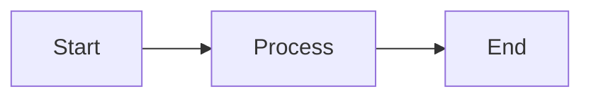

# Documentation Directory

This directory contains comprehensive documentation for the blockchain project.

## Documentation Structure

```
docs/
├── index.md                    # Documentation hub (main entry point)
├── README_DOCS.md             # This file
├── conf.py                    # Sphinx configuration
├── Makefile                   # Documentation build commands
│
├── architecture/              # System architecture documentation
│   ├── overview.md           # High-level architecture
│   ├── consensus.md          # Consensus mechanism
│   ├── network.md            # Network protocol
│   └── storage.md            # Storage layer
│
├── api/                       # API documentation
│   ├── rest-api.md           # REST API reference
│   ├── websocket.md          # WebSocket API
│   ├── rpc.md                # RPC interface
│   └── sdk.md                # SDK documentation
│
├── deployment/                # Deployment guides
│   ├── local-setup.md        # Local development setup
│   ├── testnet.md            # Testnet deployment
│   ├── production.md         # Production deployment
│   ├── configuration.md      # Configuration options
│   └── monitoring.md         # Monitoring and logging
│
├── security/                  # Security documentation
│   ├── overview.md           # Security overview
│   ├── wallets.md            # Wallet security
│   ├── contracts.md          # Smart contract security
│   ├── audits.md             # Audit reports
│   └── compliance.md         # Compliance information
│
├── user-guides/              # End-user guides
│   ├── getting-started.md    # Quick start guide
│   ├── wallet-setup.md       # Wallet setup
│   ├── transactions.md       # Making transactions
│   ├── mining.md             # Mining guide
│   ├── staking.md            # Staking guide
│   ├── troubleshooting.md    # Common issues
│   └── faq.md                # Frequently asked questions
│
└── examples/                  # Code examples and tutorials
    ├── code-examples.md      # Code samples
    ├── tutorials.md          # Step-by-step tutorials
    └── use-cases.md          # Real-world use cases
```

## Documentation Tools

This project uses multiple documentation tools:

### MkDocs (Primary - User Facing)

Material for MkDocs provides a modern, responsive documentation site.

**Features:**
- Material theme with dark mode
- Full-text search
- Mobile responsive
- Syntax highlighting
- Mermaid diagrams
- Social links

**Configuration:** `../mkdocs.yml`

### Sphinx (API Documentation)

Sphinx generates API documentation from Python docstrings.

**Features:**
- Automatic API documentation
- Cross-references
- Multiple output formats (HTML, PDF, EPUB)
- LaTeX support

**Configuration:** `conf.py`

### pdoc3 (Alternative API Docs)

Lightweight API documentation generator.

**Features:**
- Simple, clean output
- Auto-generated from docstrings
- Minimal configuration

## Building Documentation

### Prerequisites

Install documentation tools:

```bash
pip install sphinx sphinx-rtd-theme mkdocs mkdocs-material pdoc3
```

### Quick Build

```bash
# Build MkDocs documentation (recommended)
cd docs
make mkdocs

# Build Sphinx HTML documentation
make html

# Build API documentation
make api
```

### Available Make Targets

```bash
make help           # Show all available targets
make html           # Build HTML with Sphinx
make mkdocs         # Build HTML with MkDocs
make serve          # Serve docs locally (http://127.0.0.1:8000)
make pdf            # Build PDF documentation
make epub           # Build EPUB documentation
make api            # Generate API docs with pdoc3
make all            # Build all formats
make clean          # Remove build artifacts
make check          # Check for errors
make linkcheck      # Validate external links
make deploy         # Deploy to GitHub Pages
```

### Development Server

For live editing with auto-reload:

```bash
# MkDocs live server
make serve

# Sphinx live server (requires sphinx-autobuild)
make watch
```

Then navigate to `http://127.0.0.1:8000` in your browser.

## Writing Documentation

### Style Guide

#### General Guidelines

1. **Use clear, concise language**
2. **Write in present tense**
3. **Use active voice**
4. **Include code examples**
5. **Add diagrams where helpful**
6. **Link to related documentation**

#### Markdown Formatting

```markdown
# H1 - Main title (one per page)
## H2 - Major sections
### H3 - Subsections
#### H4 - Details

**Bold text** for emphasis
*Italic text* for terminology
`inline code` for commands/code
[Link text](url) for hyperlinks

> Blockquotes for important notes
```

#### Code Blocks

Use fenced code blocks with language specification:

````markdown
```python
def example_function():
    return "Hello, World!"
```

```bash
# Shell commands
blockchain wallet create
```

```json
{
  "key": "value"
}
```
````

#### Admonitions

```markdown
!!! note
    This is a note.

!!! warning
    This is a warning.

!!! danger
    This is a critical warning.

!!! tip
    This is a helpful tip.

!!! info
    This is informational content.
```

#### Tables

```markdown
| Column 1 | Column 2 | Column 3 |
|----------|----------|----------|
| Value 1  | Value 2  | Value 3  |
| Value 4  | Value 5  | Value 6  |
```

#### Diagrams

Use Mermaid for diagrams:

````markdown

````

### Python Docstrings

For API documentation, use Google-style docstrings:

```python
def example_function(param1: str, param2: int) -> bool:
    """Brief description of the function.

    Detailed description of what the function does,
    including any important details.

    Args:
        param1: Description of param1
        param2: Description of param2

    Returns:
        Description of return value

    Raises:
        ValueError: When param2 is negative
        TypeError: When param1 is not a string

    Example:
        >>> example_function("test", 42)
        True
    """
    pass
```

## Documentation Workflow

### Adding New Documentation

1. **Create the file** in the appropriate directory
2. **Write content** following the style guide
3. **Add to navigation** in `mkdocs.yml`
4. **Build and review** locally
5. **Submit pull request**

### Updating Existing Documentation

1. **Edit the file** with your changes
2. **Build locally** to verify
3. **Check links** with `make linkcheck`
4. **Submit pull request**

### Review Process

1. Documentation changes are reviewed for:
   - Accuracy
   - Clarity
   - Completeness
   - Formatting
   - Links validity

2. Automated checks:
   - Spell checking
   - Link validation
   - Build success

## Deployment

### GitHub Pages

Documentation is automatically deployed to GitHub Pages on merge to main:

```bash
# Manual deployment
make deploy
```

### Custom Domain

Configure in repository settings:
- Settings → Pages → Custom domain

### Versioning

Documentation supports multiple versions:

```bash
# Deploy version
mike deploy v1.0 latest --update-aliases
mike set-default latest
```

## Best Practices

### Content Organization

- **One topic per page** for clarity
- **Logical hierarchy** in navigation
- **Cross-link** related topics
- **Include examples** for practical use
- **Update regularly** as code changes

### Accessibility

- **Use semantic HTML** headings
- **Provide alt text** for images
- **Ensure color contrast** for readability
- **Support keyboard navigation**

### SEO

- **Descriptive titles** for each page
- **Meta descriptions** where applicable
- **Meaningful URLs** in navigation
- **Proper heading hierarchy**

## Quality Checks

### Before Committing

```bash
# Build all formats
make all

# Check for errors
make check

# Validate links
make linkcheck

# Check spelling (if configured)
make spelling
```

### CI/CD Integration

Documentation builds are tested on pull requests:

- Build success
- Link validation
- Spell checking
- Style compliance

## Documentation Statistics

View documentation stats:

```bash
make stats
```

Output includes:
- Number of markdown files
- Total lines of documentation
- File distribution

## Getting Help

### Documentation Issues

- Report bugs: [GitHub Issues](https://github.com/blockchain-project/issues)
- Suggest improvements: [Discussions](https://github.com/blockchain-project/discussions)
- Ask questions: [Discord #docs channel](https://discord.gg/blockchain)

### Contributing

See [CONTRIBUTING.md](../CONTRIBUTING.md) for:
- Contribution guidelines
- Code of conduct
- Development workflow

## Useful Resources

### MkDocs
- [MkDocs Documentation](https://www.mkdocs.org/)
- [Material for MkDocs](https://squidfunk.github.io/mkdocs-material/)
- [Markdown Guide](https://www.markdownguide.org/)

### Sphinx
- [Sphinx Documentation](https://www.sphinx-doc.org/)
- [Read the Docs Theme](https://sphinx-rtd-theme.readthedocs.io/)
- [reStructuredText Primer](https://www.sphinx-doc.org/en/master/usage/restructuredtext/basics.html)

### Writing
- [Google Developer Documentation Style Guide](https://developers.google.com/style)
- [Microsoft Writing Style Guide](https://docs.microsoft.com/en-us/style-guide/)

---

*For questions about documentation, contact: docs@blockchain-project.io*
