# XAI Blockchain Architecture Diagrams

Visual documentation of the XAI blockchain system architecture.

## System Overview

High-level view of the main components and their interactions.

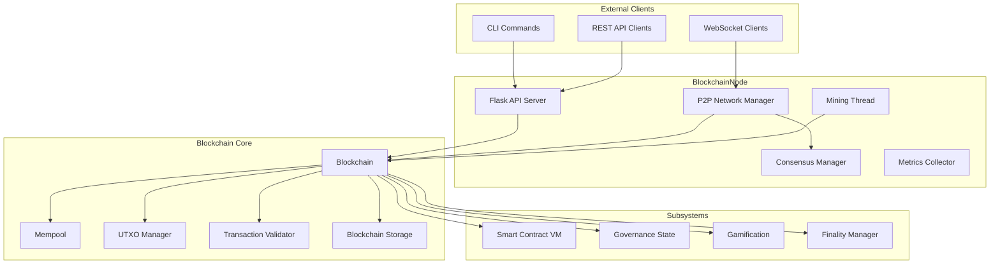

## Transaction Flow

Complete lifecycle of a transaction from submission to confirmation.

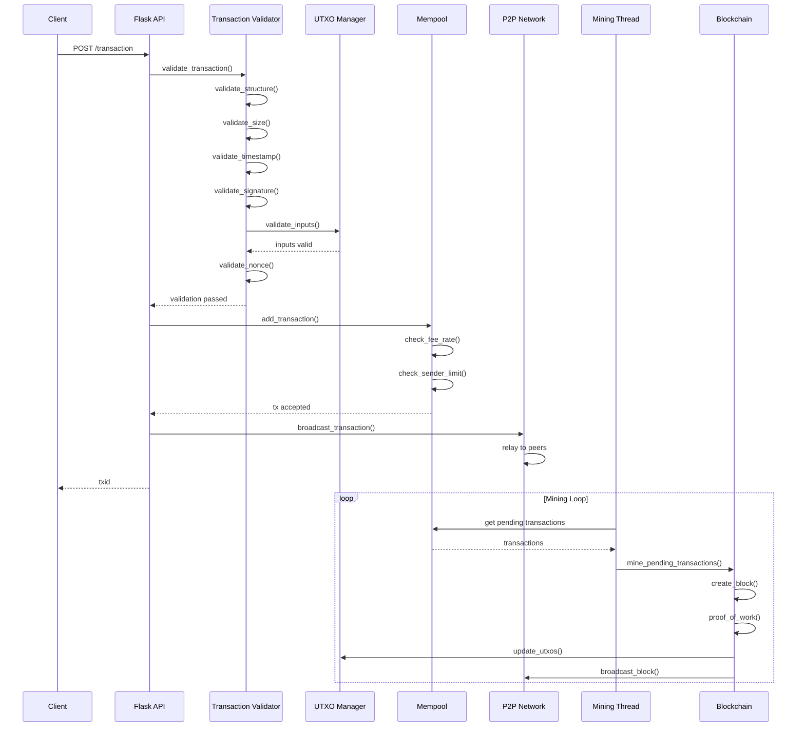

## Block Production

Mining and block creation workflow.

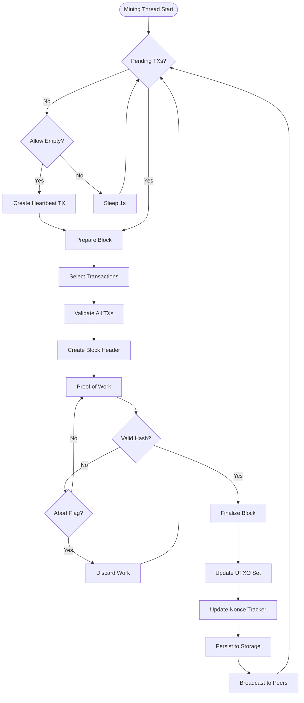

## Component Dependencies

Key class relationships in the core blockchain module.

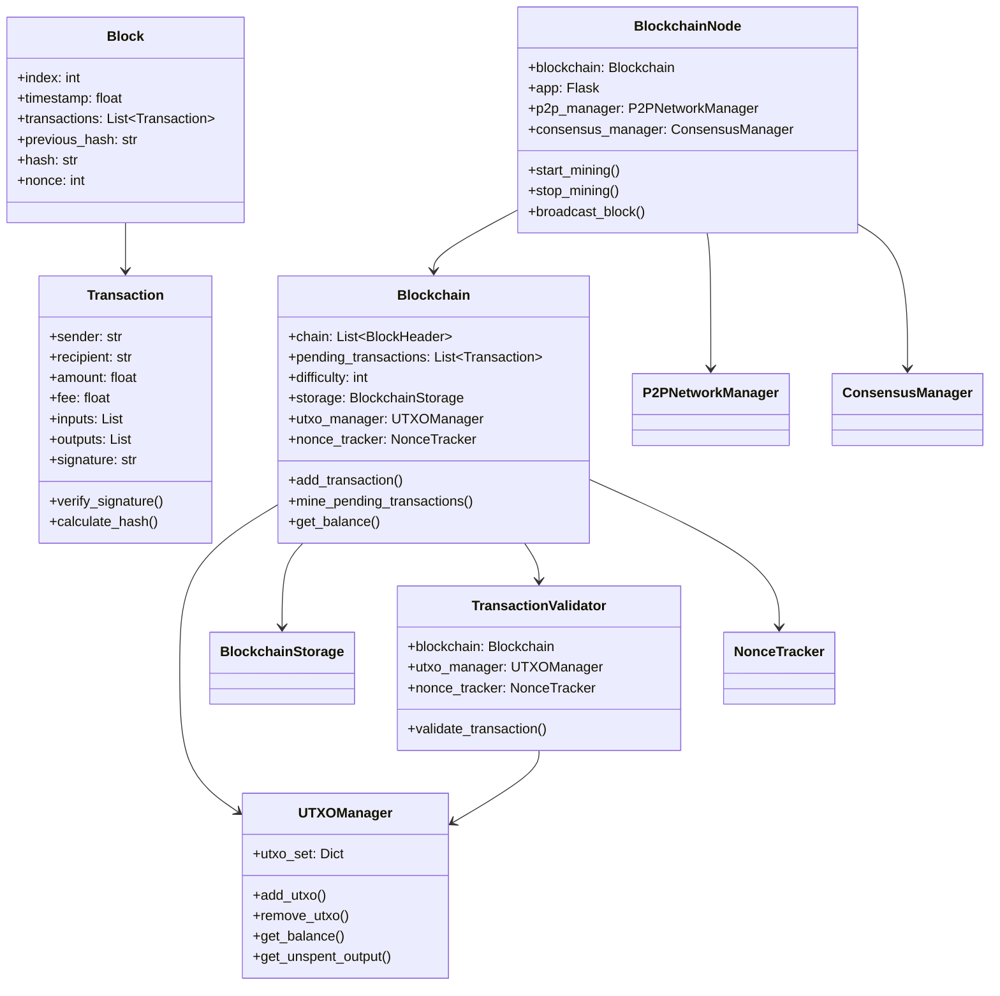

## Data Flow

UTXO model and mempool data flow.

```mermaid
flowchart LR
    subgraph "Transaction Creation"
        WALLET[Wallet] --> SELECT_UTXO[Select UTXOs]
        SELECT_UTXO --> CREATE_TX[Create Transaction]
        CREATE_TX --> SIGN[Sign Transaction]
    end

    subgraph "Mempool"
        SIGN --> VALIDATE[Validate]
        VALIDATE --> FEE_CHECK[Fee Rate Check]
        FEE_CHECK --> SENDER_CAP[Sender Limit Check]
        SENDER_CAP --> MEMPOOL[(Mempool)]
    end

    subgraph "Block Inclusion"
        MEMPOOL --> MINE[Mining]
        MINE --> NEW_BLOCK[New Block]
    end

    subgraph "State Update"
        NEW_BLOCK --> SPEND[Mark Inputs Spent]
        SPEND --> CREATE_UTXO[Create New UTXOs]
        CREATE_UTXO --> UPDATE_BAL[Update Balances]
        UPDATE_BAL --> UTXO_SET[(UTXO Set)]
    end

    UTXO_SET -.-> SELECT_UTXO
```

## API Layer Organization

Flask routes and their handlers.

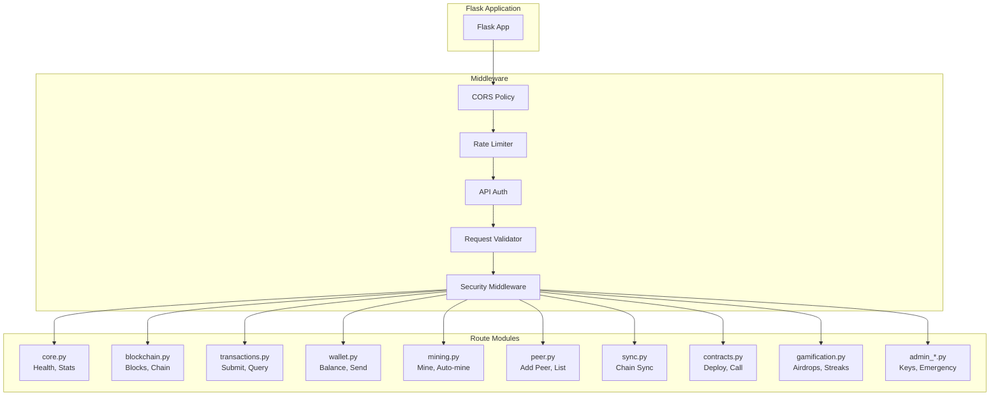

## P2P Network Architecture

Peer-to-peer communication flow.

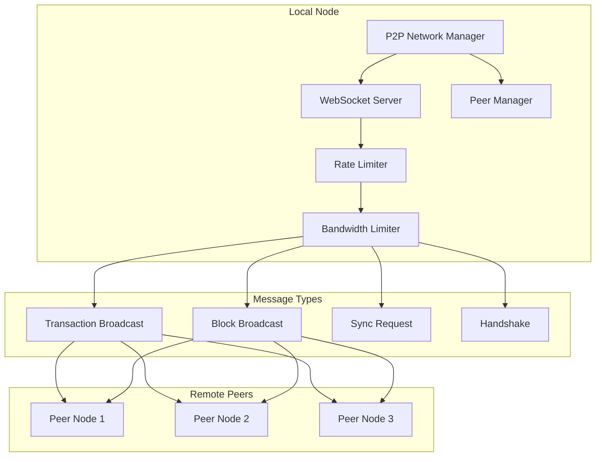

## Smart Contract Execution

Contract deployment and execution flow.

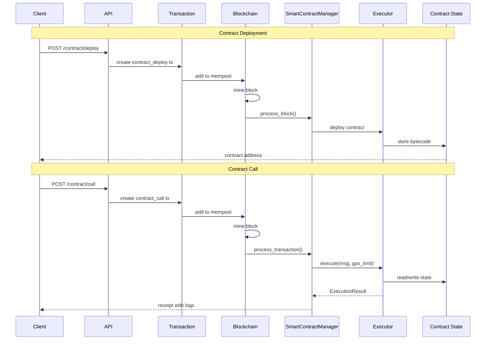

## Storage Architecture

Persistence and data storage structure.

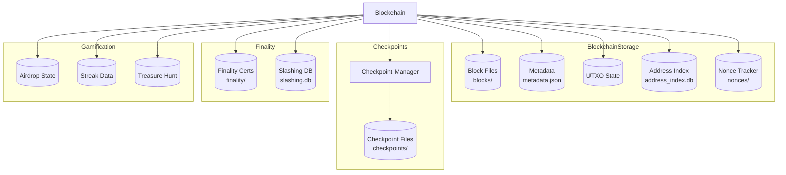

## Security Layers

Security validation and middleware stack.

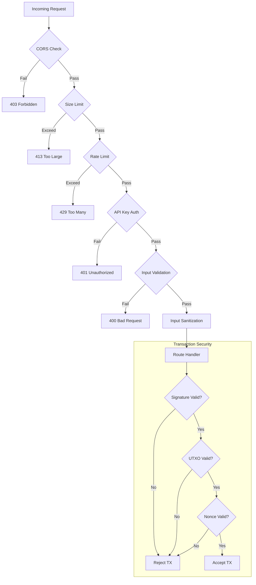

## Sandbox Execution

Secure code execution for mini-apps.

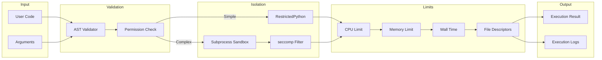
