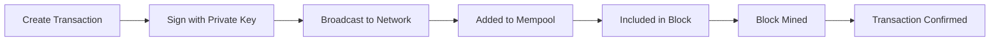

# Getting Started Guide

Welcome to the blockchain project! This guide will help you get started quickly.

## Quick Start

### 1. Installation

Choose your platform:

=== "Windows"

    ```bash
    # Download installer
    curl -O https://blockchain-project.io/downloads/installer-windows.exe

    # Run installer
    ./installer-windows.exe
    ```

=== "macOS"

    ```bash
    # Using Homebrew
    brew tap blockchain-project/tap
    brew install blockchain-node
    ```

=== "Linux"

    ```bash
    # Using package manager (Ubuntu/Debian)
    wget -qO- https://blockchain-project.io/install.sh | bash

    # Or download binary
    curl -O https://blockchain-project.io/downloads/blockchain-linux-amd64
    chmod +x blockchain-linux-amd64
    sudo mv blockchain-linux-amd64 /usr/local/bin/blockchain
    ```

### 2. Create Your First Wallet

```bash
# Create a new wallet
blockchain wallet create

# Sample output:
# Address: 1A1zP1eP5QGefi2DMPTfTL5SLmv7DivfNa
# Mnemonic: word1 word2 word3 ... word12
# ⚠️  IMPORTANT: Save your mnemonic phrase securely!
```

### 3. Check Your Balance

```bash
# Check wallet balance
blockchain wallet balance

# Output:
# Balance: 0.00000000 COIN
```

### 4. Receive Funds

Share your wallet address to receive funds:

```bash
# Display your address
blockchain wallet address

# Generate QR code
blockchain wallet qr
```

### 5. Send a Transaction

```bash
# Send funds
blockchain send --to RECIPIENT_ADDRESS --amount 1.5

# With fee specification
blockchain send --to RECIPIENT_ADDRESS --amount 1.5 --fee 0.0001
```

## Core Concepts

### Blockchain Basics

A blockchain is a distributed ledger that records transactions in blocks. Key concepts:

- **Block**: Container of transactions
- **Transaction**: Transfer of value
- **Wallet**: Your account on the blockchain
- **Address**: Public identifier for receiving funds
- **Private Key**: Secret key for spending funds

### Transaction Lifecycle



### Confirmation Times

| Confirmations | Security Level | Use Case |
|---------------|----------------|----------|
| 0 (Unconfirmed) | None | Not recommended |
| 1 | Low | Small amounts |
| 3 | Medium | Standard transactions |
| 6 | High | Large amounts |
| 12+ | Very High | Critical transactions |

## Common Tasks

### Managing Multiple Wallets

```bash
# Create additional wallet
blockchain wallet create --name "savings"

# List all wallets
blockchain wallet list

# Switch active wallet
blockchain wallet use "savings"
```

### Backing Up Your Wallet

```bash
# Export wallet
blockchain wallet export --output wallet-backup.json

# Backup mnemonic (display only - write it down!)
blockchain wallet mnemonic

# Verify backup
blockchain wallet verify-backup wallet-backup.json
```

### Restoring a Wallet

```bash
# Restore from mnemonic
blockchain wallet restore

# Restore from backup file
blockchain wallet import --file wallet-backup.json
```

### Viewing Transaction History

```bash
# List transactions
blockchain transactions list

# Get transaction details
blockchain transaction get TX_HASH

# Filter by date
blockchain transactions list --since 2025-01-01

# Export to CSV
blockchain transactions export --format csv --output tx-history.csv
```

## Network Participation

### Running a Node

```bash
# Start node
blockchain node start

# Check node status
blockchain node status

# View connected peers
blockchain node peers

# Stop node
blockchain node stop
```

### Mining (if applicable)

```bash
# Start mining
blockchain mine start

# Check mining status
blockchain mine status

# Set mining address
blockchain mine set-address YOUR_ADDRESS

# Stop mining
blockchain mine stop
```

## Security Best Practices

### Wallet Security

1. **Never share your private key or mnemonic phrase**
2. **Use strong passwords** for wallet encryption
3. **Enable 2FA** if available
4. **Use hardware wallets** for large amounts
5. **Regular backups** in multiple secure locations

### Transaction Security

1. **Double-check recipient addresses** before sending
2. **Start with small test transactions** for new recipients
3. **Wait for confirmations** based on transaction value
4. **Verify transaction details** before signing
5. **Keep software updated** to latest version

### General Security

- Use official software from verified sources
- Keep your system updated
- Use antivirus software
- Be wary of phishing attempts
- Never enter your keys on untrusted websites

## Configuration

### Basic Configuration

Create `~/.blockchain/config.yaml`:

```yaml
# Network settings
network:
  mainnet: true
  peers:
    - node1.blockchain-project.io:8333
    - node2.blockchain-project.io:8333

# Wallet settings
wallet:
  default_fee: 0.0001
  auto_backup: true
  backup_path: ~/backups/blockchain/

# Display settings
display:
  currency: USD
  decimal_places: 8
```

### Advanced Configuration

```yaml
# RPC settings
rpc:
  enabled: true
  host: 127.0.0.1
  port: 8332
  username: rpcuser
  password: rpcpassword

# Mining settings
mining:
  threads: 4
  payout_address: YOUR_ADDRESS

# Privacy settings
privacy:
  use_tor: false
  tor_proxy: 127.0.0.1:9050
```

## Troubleshooting

### Common Issues

#### "Insufficient funds" error

**Solution**: Check your balance and ensure you have enough for both the amount and transaction fee.

```bash
blockchain wallet balance
```

#### "Transaction not confirming"

**Solution**: Increase the transaction fee or wait longer. You can check mempool status:

```bash
blockchain mempool status
```

#### "Cannot connect to network"

**Solution**: Check your internet connection and firewall settings. Try adding peers manually:

```bash
blockchain node add-peer NODE_ADDRESS:PORT
```

#### "Wallet file corrupted"

**Solution**: Restore from backup:

```bash
blockchain wallet restore --from-backup wallet-backup.json
```

## Next Steps

Now that you're set up, explore more advanced features:

- [Wallet Setup Guide](wallet-setup.md) - Advanced wallet features
- [Transaction Guide](transactions.md) - Detailed transaction information
- [Mining Guide](mining.md) - Start mining (if applicable)
- [API Documentation](../api/rest-api.md) - Programmatic access
- [Security Guide](../security/overview.md) - Advanced security

## Getting Help

### Documentation

- [FAQ](faq.md)
- [Troubleshooting Guide](troubleshooting.md)
- [API Reference](../api/rest-api.md)

### Community

- Discord: [Join our server](https://discord.gg/blockchain)
- Forum: [community.blockchain-project.io](https://community.blockchain-project.io)
- Twitter: [@blockchain_project](https://twitter.com/blockchain_project)

### Support

- Email: support@blockchain-project.io
- Live Chat: Available on website during business hours

## Glossary

- **Address**: Public identifier for receiving funds
- **Block**: Group of transactions added to the blockchain
- **Blockchain**: Distributed ledger of all transactions
- **Confirmation**: Inclusion of a transaction in a block
- **Hash**: Unique identifier for blocks and transactions
- **Mempool**: Pool of unconfirmed transactions
- **Mnemonic**: 12/24 word phrase for wallet recovery
- **Node**: Computer running blockchain software
- **Private Key**: Secret key for accessing funds
- **Public Key**: Cryptographic key derived from private key
- **Transaction**: Transfer of value on the blockchain
- **UTXO**: Unspent Transaction Output
- **Wallet**: Software for managing your funds

---

*Welcome to the blockchain! If you have questions, don't hesitate to reach out to our community.*
